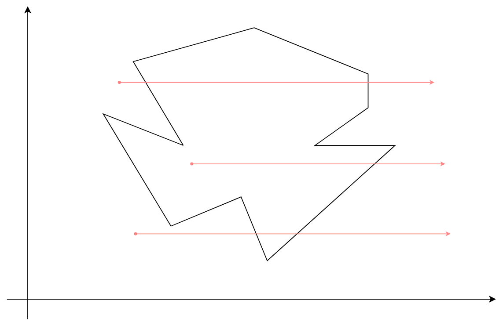
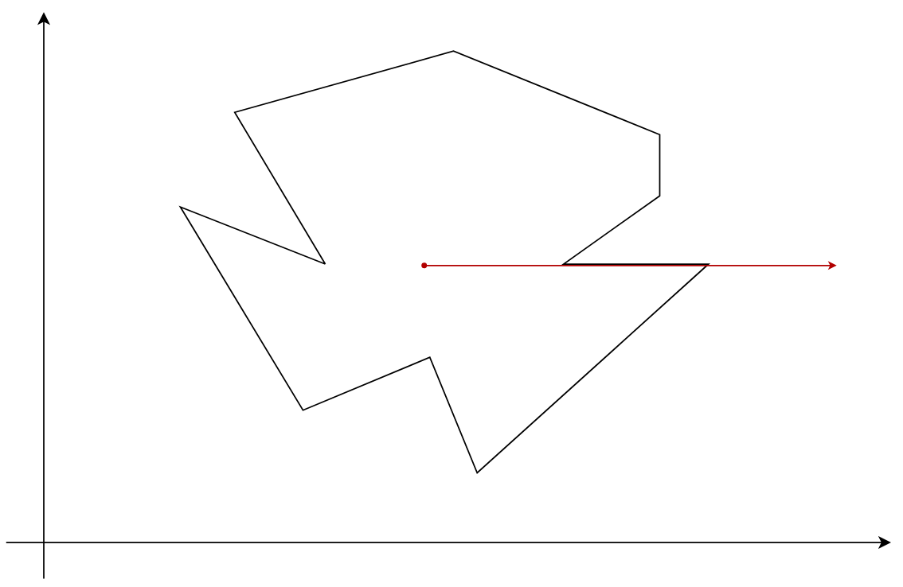
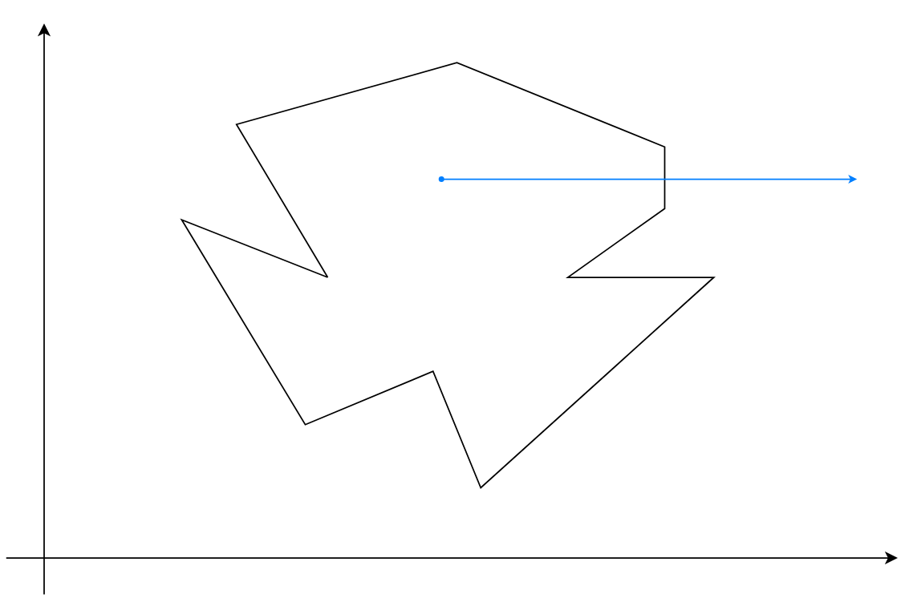
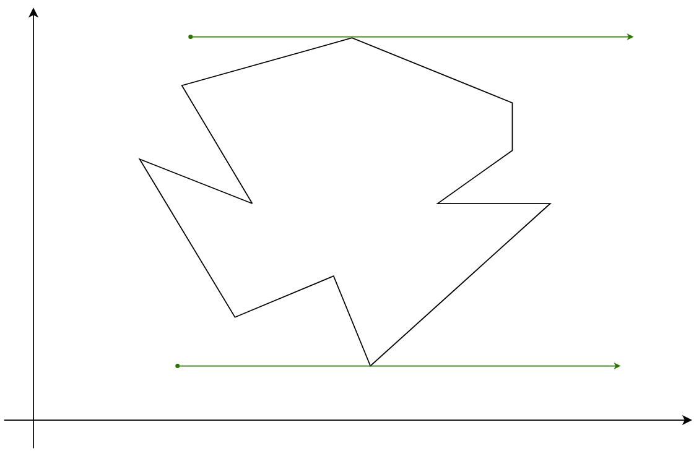

# 判断点是否在多边形内

## 题目

1. 要求: 编写程序判断测试用例中的四个点: p1、p2、p3、p4, 是否在同级的经纬度文件 location.json 框起来的范围内
2. 测试用例

```
p1: 119.037089, 32.259867
p2: 118.821489, 32.077388
p3: 118.80657099, 32.0353893
p4: 118.894173, 32.077862
```

<details>
<summary style="cursor: pointer;">location.json 文件</summary>

```json
[
  [118.897299, 32.02599],
  [118.893303, 32.026212],
  [118.895235, 32.028178],
  [118.894384, 32.032069],
  [118.892003, 32.034575],
  [118.885522, 32.034631],
  [118.883062, 32.035544],
  [118.885012, 32.036735],
  [118.885706, 32.039075],
  [118.882035, 32.041],
  [118.882474, 32.042578],
  [118.878943, 32.041401],
  [118.877634, 32.045555],
  [118.879646, 32.046496],
  [118.877766, 32.048919],
  [118.87954, 32.049736],
  [118.881587, 32.047881],
  [118.887313, 32.05076],
  [118.888262, 32.054747],
  [118.888244, 32.058637],
  [118.885969, 32.06099],
  [118.88806, 32.060962],
  [118.884915, 32.067108],
  [118.882658, 32.067648],
  [118.881499, 32.06935],
  [118.875904, 32.072395],
  [118.877002, 32.075343],
  [118.880225, 32.072617],
  [118.883879, 32.070762],
  [118.881604, 32.074167],
  [118.8851, 32.075523],
  [118.884959, 32.078319],
  [118.888051, 32.076644],
  [118.888657, 32.074707],
  [118.892961, 32.07461],
  [118.894173, 32.077862],
  [118.893066, 32.078554],
  [118.897177, 32.081045],
  [118.89766, 32.082457],
  [118.900918, 32.082429],
  [118.90834, 32.086512],
  [118.907883, 32.088103],
  [118.904054, 32.090663],
  [118.900637, 32.095326],
  [118.897124, 32.094565],
  [118.891538, 32.098066],
  [118.889834, 32.098315],
  [118.887006, 32.101802],
  [118.883589, 32.103642],
  [118.878197, 32.103255],
  [118.877547, 32.100847],
  [118.874323, 32.09974],
  [118.871741, 32.101013],
  [118.868685, 32.099671],
  [118.867437, 32.100709],
  [118.863854, 32.100169],
  [118.859963, 32.098343],
  [118.858619, 32.096627],
  [118.854316, 32.09772],
  [118.849037, 32.096973],
  [118.847851, 32.097554],
  [118.84281, 32.09707],
  [118.841765, 32.099035],
  [118.844698, 32.098869],
  [118.843029, 32.101885],
  [118.834466, 32.093998],
  [118.833491, 32.095063],
  [118.840307, 32.101041],
  [118.839569, 32.103296],
  [118.842318, 32.105275],
  [118.841677, 32.106036],
  [118.834431, 32.104279],
  [118.831392, 32.105275],
  [118.826438, 32.104901],
  [118.82628, 32.103601],
  [118.819149, 32.10367],
  [118.818033, 32.095672],
  [118.811674, 32.095575],
  [118.809127, 32.09617],
  [118.806606, 32.098066],
  [118.802461, 32.097042],
  [118.799773, 32.095133],
  [118.799115, 32.093237],
  [118.796831, 32.091839],
  [118.797788, 32.089113],
  [118.793476, 32.088408],
  [118.784096, 32.092268],
  [118.784104, 32.041761],
  [118.827167, 32.038729],
  [118.826676, 32.034174],
  [118.828292, 32.0338],
  [118.830066, 32.039034],
  [118.831655, 32.039809],
  [118.838067, 32.040058],
  [118.836934, 32.035752],
  [118.839745, 32.034921],
  [118.838076, 32.029757],
  [118.843126, 32.028801],
  [118.844171, 32.027804],
  [118.844285, 32.022445],
  [118.845981, 32.022043],
  [118.846472, 32.020008],
  [118.850275, 32.018845],
  [118.853367, 32.020132],
  [118.85327, 32.023636],
  [118.857416, 32.021573],
  [118.862536, 32.023567],
  [118.864838, 32.021143],
  [118.875105, 32.024204],
  [118.876572, 32.021116],
  [118.876273, 32.017446],
  [118.880638, 32.014842],
  [118.884959, 32.018914],
  [118.895051, 32.022847],
  [118.897299, 32.02599]
]
```

</details>

## 思路

### 解题方法

**射线法**: 从一点向任意方向(<span style="background: yellow; color: black;">这里取水平向右</span>)发射一条射线, 若该射线与多边形的交点为奇数个则在多边形内部, 为偶数则在多边形外部



### 要解决的问题:

1. 如何判断点与线的位置关系?
2. 如何获取交点坐标?

### 特殊情况

1. 点过一条平行边



2. 点过一条垂直边



3. 点过凹顶点, 凸顶点



### 解决方案:

1. 对于平行边不做考虑, 因为在相邻的线段判断中会包含顶点的判断
2. 对于顶点相交的情况, 只计数所属边上的较高顶点
3. 对于垂直边可直接判断相交

### 预备知识

若 $\vec{a}$ = ($x_1$, $y_1$, $z_1$),$\vec{b}$ = ($x_2$, $y_2$, $z_2$);

1. 向量的点乘和叉乘

   - 点乘: $\vec{a}$$\cdot$$\vec{b}$ = $x_1$$x_2$ + $y_1$$y_2$ + $z_1$$z_2$, 对于二维坐标 -> $\vec{a}$$\cdot$$\vec{b}$ = $x_1$$x_2$;
   - 叉乘: $\vec{a}$$\times$$\vec{b}$ = ($y_{a}$$z_{b}$ - $z_{a}$$y_{b}$, $z_{a}$$x_{b}$ - $x_{a}$$z_{b}$, $x_{a}$$y_{b}$ - $y_{a}$$x_{b}$), 对于二维坐标 -> $\vec{a}$$\times$$\vec{b}$ = $x_{a}$$y_{b}$ - $y_{a}$$x_{b}$;

2. 向量共线判断

   - 若 $\vec{a}$$\times$$\vec{b}$ = $\vec{0}$, 则 $\vec{a}$ 和 $\vec{b}$ 平行
   - 如果 $\vec{a}$ 和 $\vec{b}$ 共线, 则, $\vec{a}$$\cdot$$\vec{b}$ = |$\vec{a}$|$\cdot$|$\vec{b}$|
   - $\cos$$\theta$ = $x_1$$x_2$ + $y_1$$y_2$ + $z_1$$z_2$;

## 代码

1. Point.java

```java
package org.pomeluce.point.model;

import java.io.Serializable;
import java.util.Objects;

/**
 * @author : lucas
 * @version 1.0
 * @date : 2023/9/24上午10:07
 * @className : Point
 * @description : TODO: 点坐标
 */
public class Point implements Serializable {
    private Double x;
    private Double y;

    public Point() {
    }

    public Point(Double x, Double y) {
        this.x = x;
        this.y = y;
    }

    public Double getX() {
        return x;
    }

    public void setX(Double x) {
        this.x = x;
    }

    public Double getY() {
        return y;
    }

    public void setY(Double y) {
        this.y = y;
    }

    @Override
    public boolean equals(Object o) {
        if (this == o) return true;
        if (!(o instanceof Point point)) return false;

        if (!Objects.equals(x, point.x)) return false;
        return Objects.equals(y, point.y);
    }

    @Override
    public int hashCode() {
        int result = x != null ? x.hashCode() : 0;
        result = 31 * result + (y != null ? y.hashCode() : 0);
        return result;
    }

    @Override
    public String toString() {
        return "Point{" +
                "x=" + x +
                ", y=" + y +
                '}';
    }
}
```

2. Main.java

```java
package org.pomeluce.point;

import com.fasterxml.jackson.databind.ObjectMapper;
import org.apache.commons.io.FileUtils;
import org.pomeluce.point.model.Point;

import java.io.File;
import java.io.IOException;
import java.net.URLDecoder;
import java.nio.charset.StandardCharsets;
import java.util.List;
import java.util.Objects;

/**
 * @author : lucas
 * @version 1.0
 * @date : 2023/9/24上午10:00
 * @className : Main
 * @description : TODO(一句话描述该类的功能)
 */
public class Main {
    public static void main(String[] args) {
        // get point list file
        String fileName = URLDecoder.decode(Objects.requireNonNull(Main.class.getClassLoader().getResource("latlon.json")).getPath(), StandardCharsets.UTF_8);

        try {
            // get json data
            String sourceJson = FileUtils.readFileToString(new File(fileName), StandardCharsets.UTF_8);
            // get mapper object
            ObjectMapper mapper = new ObjectMapper();
            // conversion string to list
            @SuppressWarnings("unchecked") List<List<Double>> list = mapper.readValue(sourceJson, List.class);

           /*
                p1:119.037089, 32.259867 不再
                p2:118.821489, 32.077388 // 内部
                p3:118.80657099, 32.0353893 不再
                p4:118.894173, 32.077862  线上
            */
            // Point source = new Point(119.037089, 32.259867);
            // Point source = new Point(118.821489, 32.077388);
            Point source = new Point(118.80657099, 32.0353893);
            // Point source = new Point(118.894173, 32.077862);

            System.out.println(judge(list, source));

        } catch (IOException e) {
            throw new RuntimeException(e);
        }
    }


    /**
     * 判断点是否在点集合多边形内
     *
     * @param list   点集合
     * @param target 目标点
     * @return 返回一个 boolean 类型的判断结果
     */
    public static boolean judge(List<List<Double>> list, Point target) {
        // 标志变量
        boolean flag = false;
        for (int i = 0, j = list.size() - 1; i < list.size(); j = i++) {
            // 判断点是否在边上
            if (isCollinear(target, list.get(i), list.get(j))) return true;
            /* 判断在多边形内 */
            List<Double> p1 = list.get(i);
            List<Double> p2 = list.get(j);
            // 如果为水平线段则忽略
            if (compareTo(p1.get(1), p2.get(1)) == 0) continue;
            // 判断是否在两条边之间
            if (compareTo(Math.min(p1.get(1), p2.get(1)), target.getY()) < 0 && compareTo(Math.max(p1.get(1), p2.get(1)), target.getY()) >= 0) {
                // 判断该边是否为垂直竖线
                if (compareTo(p1.get(0), p2.get(0)) == 0 && compareTo(target.getX(), p1.get(0)) <= 0) {
                    flag = !flag;
                    continue;
                }
                //
                if (compareTo(target.getX(), p1.get(0) - (p1.get(0) - p2.get(0)) * (p1.get(1) - target.getY()) / (p1.get(1) - p2.get(1))) < 0) {
                    flag = !flag;
                }
            }
        }
        return flag;
    }

    /**
     * 判断 target 点是否在 vec1 和 vec2 连成的线段内
     *
     * @param target 目标点
     * @param vec1   顶点1
     * @param vec2   顶点2
     * @return 返回一个 boolean 类型的判断结果
     */
    public static boolean isCollinear(Point target, List<Double> vec1, List<Double> vec2) {
        Point p1 = vector(target, vec1);
        Point p2 = vector(target, vec2);
        return compareTo(cross(p1, p2), 0) == 0 && compareTo(clickMultiply(p1, p2), 0) <= 0;
    }

    /**
     * 浮点数比较
     */
    public static int compareTo(double target, double source) {
        if (Math.abs(target - source) < 1e-10) return 0;
        return target - source > 0 ? 1 : -1;
    }

    /**
     * 根据点坐标获取向量
     *
     * @param start 起始坐标
     * @param end   终点坐标
     * @return 返回 Point 类型的向量结果
     */
    public static Point vector(Point start, List<Double> end) {
        return new Point(end.get(0) - start.getX(), end.get(1) - start.getY());
    }


    /**
     * 向量叉乘
     *
     * @param start 起始向量
     * @param end   终点向量
     * @return 返回 double 类型的向量叉乘结果
     */
    public static double cross(Point start, Point end) {
        return start.getX() * end.getY() - start.getY() * end.getX();
    }

    /**
     * 向量点乘
     *
     * @param start 起始向量
     * @param end   终点向量
     * @return 返回 double 类型的向量点乘结果
     */
    public static double clickMultiply(Point start, Point end) {
        return start.getX() * end.getX() + start.getY() * end.getY();
    }
}
```
