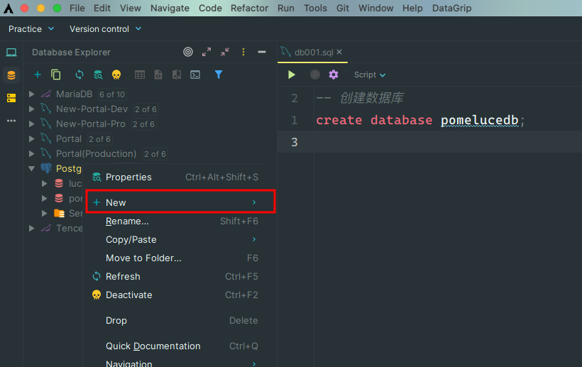
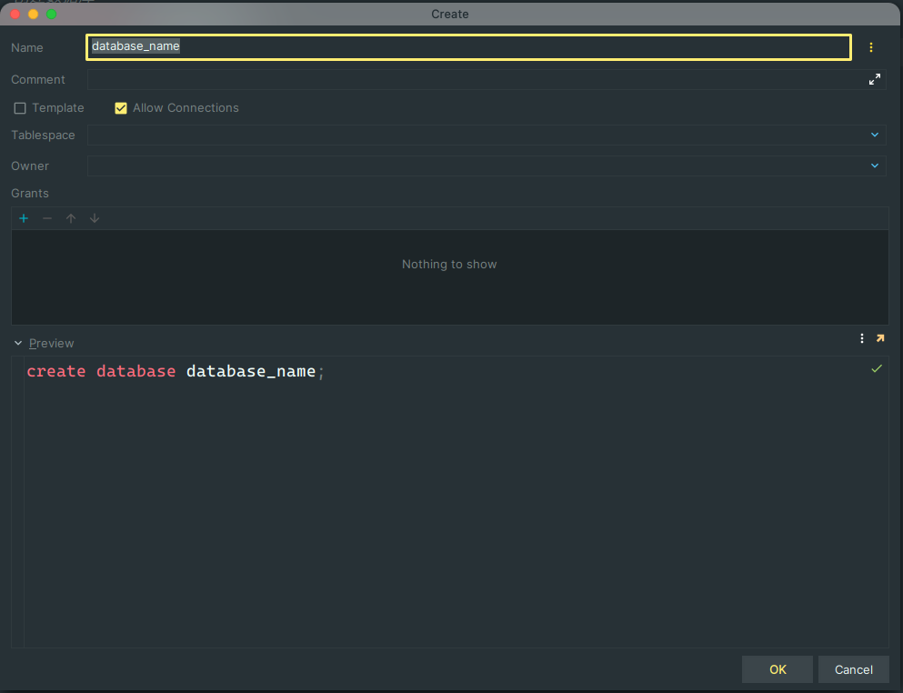
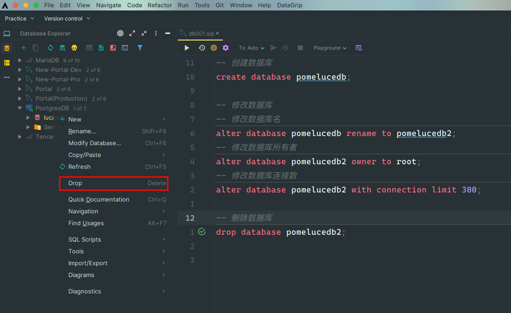

# PostgreSQL DDL

## 1. 数据库操作

### 创建数据库

PostgreSQL 创建数据库可以通过一下三种方式来创建

**1. create database 语句创建数据库**

```sql
-- 创建数据库
create database pomelucedb;
```

**2. createdb 命令创建数据库**

- createdb 是一个 SQL 命令 create database 的封装

- createdb 命令语法格式如下:

```sql
createdb [option...] [dbname [description]]
```

:::tip **参数说明：**

- **dbname**: 要创建的数据库名

- **description**: 关于新创建的数据库相关的说明

- **options**: 参数可选项，可以是以下值:

| 选项              | 描述                                     |
| ----------------- | :--------------------------------------- |
| **-D tablespace** | 指定数据库默认表空间。                   |
| **-e**            | 将 createdb 生成的命令发送到服务端。     |
| **-E encoding**   | 指定数据库的编码。                       |
| **-l locale**     | 指定数据库的语言环境。                   |
| **-T template**   | 指定创建此数据库的模板。                 |
| **--help**        | 显示 createdb 命令的帮助信息。           |
| **-h host**       | 指定服务器的主机名。                     |
| **-p port**       | 指定服务器监听的端口，或者 socket 文件。 |
| **-U username**   | 连接数据库的用户名。                     |
| **-w**            | 忽略输入密码。                           |
| **-W**            | 连接时强制要求输入密码。                 |

:::

- 打开终端, 使用 createdb 命令进行数据库创建

```zsh
$ createdb -h localhost -p 5432 -U postgres pomelucedb
password ******
```

> 以上命令我们使用了超级用户 postgres 登录到主机地址为 localhost，端口号为 5432 的 PostgreSQL 数据库中并创建 pomelucedb 数据库

**3. 使用可视化工具创建数据库, 以 DataGrip 为例**

- 在 Database Explorer 栏右击当前已连接的 PostgreSQL 数据库, 选择 new > Database



- 在弹出的 Create 面板填写要创建的数据库信息, 然后点 ok, 创建成功



### 查看数据库

在命令行交互窗口, 输入 `\l` 命令查看所有数据库

```zsh
➜ psql -U root -d lucasdb
用户 root 的口令：psql (15.3)
输入 "help" 来获取帮助信息.

lucasdb=# \l
                                                     数据库列表
     名称    |  拥有者  | 字元编码  |    校对规则    |    Ctype    | ICU Locale | Locale Provider |       存取权限
------------+----------+----------+-------------+-------------+------------+-----------------+--------------------
 lucasdb    | root     | UTF8     | en_US.UTF-8 | en_US.UTF-8 |            | libc            |
 pomelucedb | root     | UTF8     | en_US.UTF-8 | en_US.UTF-8 |            | libc            |
 postgres   | postgres | UTF8     | en_US.UTF-8 | en_US.UTF-8 |            | libc            | =Tc/postgres      +
            |          |          |             |             |            |                 | postgres=CTc/postgres
 template0  | postgres | UTF8     | en_US.UTF-8 | en_US.UTF-8 |            | libc            | =c/postgres       +
            |          |          |             |             |            |                 | postgres=CTc/postgres
 template1  | postgres | UTF8     | en_US.UTF-8 | en_US.UTF-8 |            | libc            | =c/postgres       +
            |          |          |             |             |            |                 | postgres=CTc/postgres
(5 行记录)

lucasdb=#

```

### 切换数据库

在命令行交互窗口, 使用 `\c '数据库名'` 命令来切换数据库

```zsh
lucasdb=# \c pomelucedb;
您现在已经连接到数据库 "pomelucedb",用户 "root".
pomelucedb=#
```

### 修改数据库

数据库的修改语法为: `alter database '数据库名' 'option_name' [ = value ]`

```sql
-- 修改数据库名
alter database pomelucedb rename to pomelucedb2;
-- 修改数据库所有者
alter database pomelucedb2 owner to postgres;
-- 修改数据库连接数
alter database pomelucedb2 with connection limit 300;
```

:::warning Ps:

需要注意的是: 执行 `alter database` 语句通常需要具有适当权限的用户才能执行, 确保以具有足够权限的用户身份连接到 PostgreSQL 数据库以进行所需的更改

:::

### 删除数据库

PostgreSQL 删除数据库可以用以下三种方式:

**1. 使用 `drop database` SQL 语句来删除**

语法: drop database [if exists] name

参数说明：

- IF EXISTS: 如果数据库不存在则发出提示信息, 而不是错误信息
- name: 要删除的数据库的名称

```sql
-- 删除数据库
drop database pomelucedb2;
```

**2. 使用 dropdb 命令来删除**

**语法**: dropdb [connection-option...] [option...] dbname

参数说明：

- dbname: 要删除的数据库名
- options: 参数可选项, 可以是以下值

| 选项                        | 描述                                                                          |
| --------------------------- | :---------------------------------------------------------------------------- |
| **-e**                      | 显示 dropdb 生成的命令并发送到数据库服务器。                                  |
| **-i**                      | 在做删除的工作之前发出一个验证提示。                                          |
| **-V**                      | 打印 dropdb 版本并退出。                                                      |
| **--if-exists**             | 如果数据库不存在则发出提示信息，而不是错误信息。                              |
| **--help**                  | 显示有关 dropdb 命令的帮助信息。                                              |
| **-h host**                 | 指定运行服务器的主机名。                                                      |
| **-p port**                 | 指定服务器监听的端口，或者 socket 文件。                                      |
| **-U username**             | 连接数据库的用户名。                                                          |
| **-w**                      | 连接时忽略输入密码。                                                          |
| **-W**                      | 连接时强制要求输入密码。                                                      |
| **--maintenance-db=dbname** | 删除数据库时指定连接的数据库，默认为 postgres，如果它不存在则使用 template1。 |

```zsh
$ dropdb -h localhost -p 5432 -U postgres pomelucedb
password ******
```

:::tip

dropdb 是 DROP DATABASE 的包装器

dropdb 用于删除 PostgreSQL 数据库

dropdb 命令只能由超级管理员或数据库拥有者执行

:::

**3. 使用可视化工具**

以 DataGrip 为例, 右击数据库, 选择 Drop, 在弹出窗口点击确认, 删除数据库;



## 2. 数据表操作

### 创建表

1. 语法:

```sql
create table table_name(
	column1 datatype,
    column2 datatype,
    column3 datatype,
    ...
    primary key (一列或多列)
)
```

- `create table` 是一个关键词, 用于告诉数据库系统将创建一个数据表

- 表名字必需在同一模式中的其它表、 序列、索引、视图或外部表名字中唯一

- `create table` 在当前数据库创建一个新的空白表, 该表将由发出此命令的用户所拥有

2. 实例

```sql
-- 创建数据表
create table users
(
    id        serial primary key not null,
    name      varchar(20)        not null,
    age       int                not null,
    email     varchar(20)        not null,
    introduce text
);
```

### 更新表

1. 增加列: alter table 'table_name' add column 'col_name' 'datatype'

2. 移除列: alter table 'table_name' drop column 'col_name'

3. 增加约束: alter table 'table_name' add constraint '约束名称' 'option' [ = value ]

4. 移除约束: alter tabel 'table_name' drop constraint '约束名称'

5. 修改默认值: alter table 'table_name' alter column 'col_name' set default [ = vaule ]

6. 修改数据类型: alter table 'table_name' alter column 'col_name' type 'new_datatype'

7. 重名列: alter table 'table_name' alter column 'old_col_name' to 'new_col_name'

8. 重命名表: alter table 'table_name' alter rename to 'new_table_name'

```sql
--  增加列
alter table users add column phone char(11);
-- 移除列
alter table users drop column phone;
-- 移除列并且删除列中的数据
alter table users drop column phone cascade;
-- 增加约束
alter table users add constraint users_email_key unique (email);
-- 移除约束
alter table users drop constraint users_email_key;
-- 修改列的默认值
alter table users alter column age set default 18;
-- 移除列的默认值
alter table users alter column age drop default;
-- 修改列的数据类型
alter table users alter column age type bigint;
-- 修改列名
alter table users rename column email to mail;
-- 修改数据表名
alter table users rename to db_user;
```

### 删除表

- 语法: drop table [table_name1, table_name2, ...]

```sql
drop table db_user
```

## 3. 表注释

在 PostgreSQL 中无法在创建数据表时对表和 column 进行注释, 需要在创建完成之后, 通过 comment 语句来添加

- 语法: comment on option_name [ = value ]

```sql
comment on table users is '用户表';
comment on column users.id is '用户 ID';
comment on column users.name is '姓名';
comment on column users.age is '年龄';
comment on column users.email is '邮箱';
comment on column users.introduce is '介绍';
```
