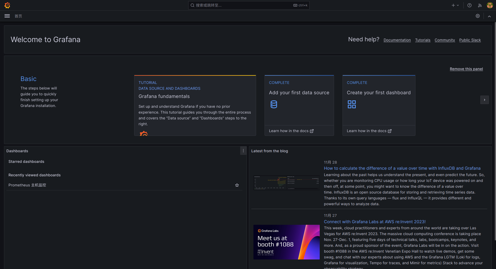
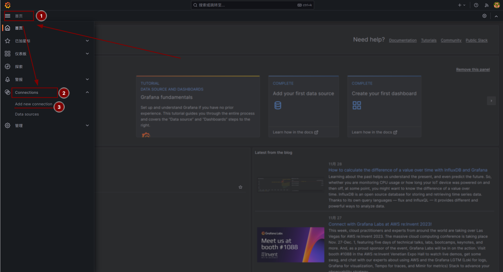
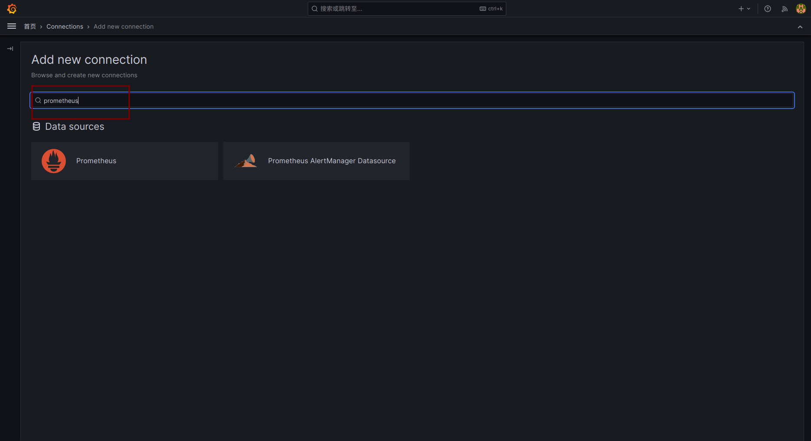
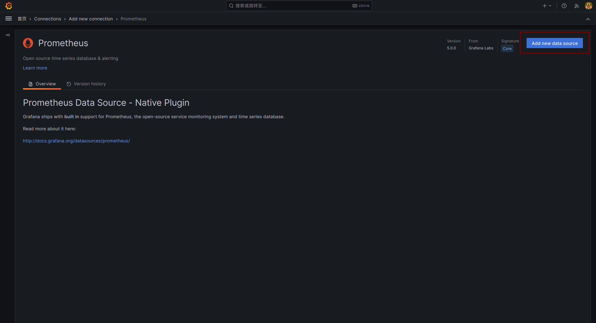
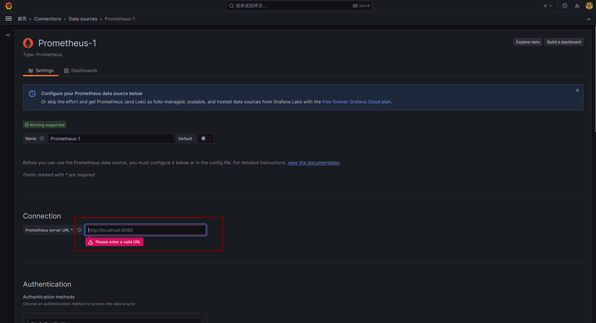
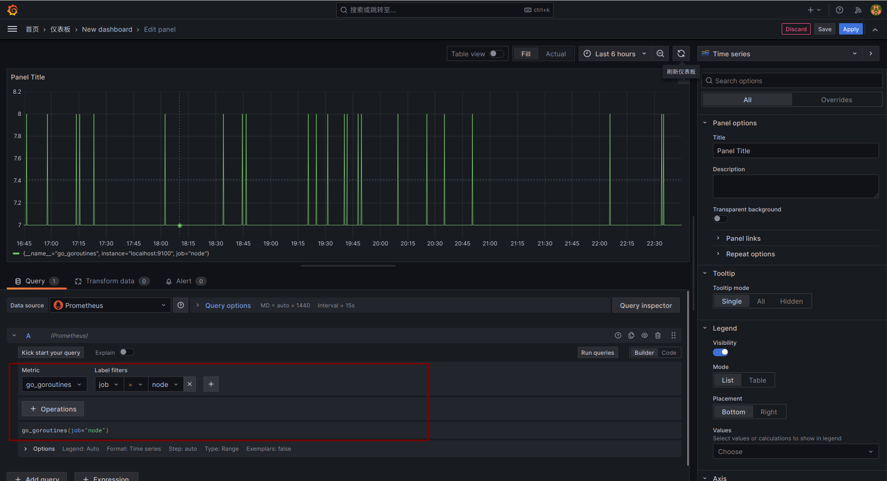

# Grafana 监控

## 软件安装

```shell
# Arch Linux
pacman/yay -S grafana
```

## 软件配置

### 面板访问

1. 软件安装完成后, 即可访问面板, 地址为: `http://ip:3000`
2. 默认用户名和密码为 admin, 登录后会要求重新设置密码, 然后进入到主页面



3. 点击右上角个头像, 点击 profile(个人资料), 找到 language 选项, 选择中文, 点击 save 保存
4. 回到首页, 点击左上角, 添加数据源, 用于监控面板的数据来源



5. 在数据源添加面板搜索 prometheus, 添加 prometheus 的 Data source 数据源



6. 点击 右上角 add new data source



7. 填写 prometheus 链接地址, 填写完成后, 点击 save & test 按钮



8. 点击菜单栏 -> 仪表盘, 选择新建 -> 新建仪表盘, 即可创建面板
9. 点击添加可视化 -> 选择刚刚添加的 prometheus 数据源, 进入面部选择 `指标 + 标签组`, 点击右上角刷新按钮, 点击 apply 保存



10. 自己新建面板太过麻烦, 可以在官方的[模板网站](https://grafana.com/grafana/dashboards/)根据要监控的服务选择何时的模板, 然后直接导入
11. 导入方式有三种: 导入模板 json 文件、通过 id 导入、复制 json 文本导入, 如果可以连接外网的话可以直接复制 id 导入, 很方便

### 域名访问

1. 修改 grafana 配置文件, `/etc/grafana.ini`
2. 设置 domain 为你的访问域名, root_url 为访问路径, serve_from_sub_path 设置为 true

```ini
domain = www.xxx.com
root_url = %(protocol)s://%(domain)s:%(http_port)s/
serve_from_sub_path = tru
```

3. 如果要开启 https 访问的话, 还需开启 https 配置和 ssl 证书

```ini
protocol = https
; https certs & key file
cert_file = /ssl/path/ssl_server.pem
cert_key = /ssl/path/ssl_private.key
```

4. nginx 设置请求转发

```nginx
 # 处理 websocket 连接升级
map $http_upgrade $connection_upgrade {
    default upgrade;
    '' close;
}

server {
    # listen       80;
    listen       443 ssl;
    server_name  www.xxx.org;

    location / {
        root    html;
        index   index.html index.htm;
        proxy_pass https://localhost:3000; # grafana 访问地址
        proxy_set_header Host $http_host; # 设置请求头 host, 防止 api/ds/query 获取数据 not-allowed
        proxy_redirect default;
        proxy_max_temp_file_size 0k;
        proxy_connect_timeout 30;
        proxy_send_timeout 60;
        proxy_read_timeout 60;
        proxy_next_upstream error timeout invalid_header http_502;
    }

    # websocket 连接升级
    location /api/live/ws {
        proxy_pass https://localhost:3000;
        proxy_http_version 1.1;
        proxy_set_header Upgrade $http_upgrade;
        proxy_set_header Connection "Upgrade";
        proxy_set_header Host $http_host;
    }
}
```

### 超时设置

- 编辑配置文件, 可选时间维度: `m (minutes), h (hours), d (days), w (weeks), M (month)`

```ini

# 经过认证的用户在下次访问之前可以处于非活动状态的最长时间(持续时间), 超过这个时间将需要重新登录 既两次请求之间时间间隔
login_maximum_inactive_lifetime_duration = 30m

# 经过认证的用户自登录时间起算, 在需要重新登录之前可以保持登录状态的最长时间(持续时间) -> 既自登录以后的持续时间
login_maximum_lifetime_duration = 1h
```
